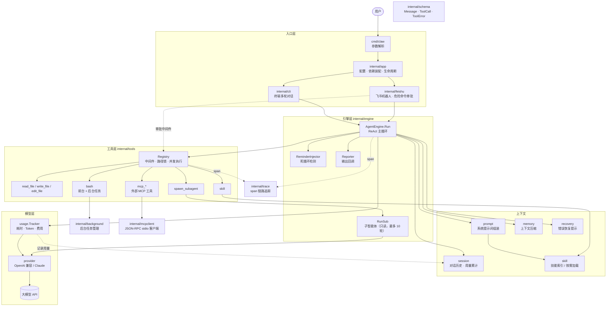
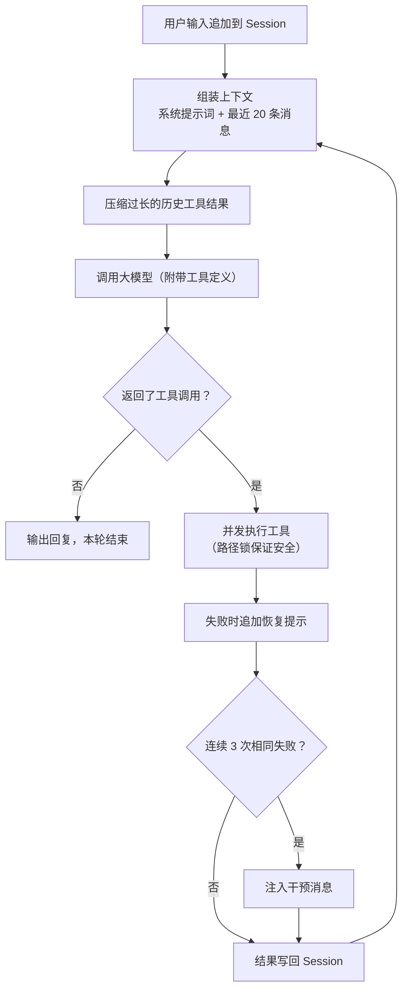

# 架构图

## 分层架构

```mermaid
flowchart TB
    User(["用户"])

    subgraph Entry["入口层"]
        Main["cmd/claw<br/>参数解析"]
        App["internal/app<br/>配置 · 依赖装配 · 生命周期"]
        CLI["internal/cli<br/>终端多轮对话"]
        Feishu["internal/feishu<br/>飞书机器人 · 危险命令审批"]
    end

    subgraph Core["引擎层 internal/engine"]
        Loop["AgentEngine.Run<br/>ReAct 主循环"]
        Sub["RunSub<br/>子智能体（只读，最多 10 轮）"]
        Reminder["ReminderInjector<br/>死循环检测"]
        Reporter["Reporter<br/>输出回调"]
    end

    subgraph Ctx["上下文"]
        Session["session<br/>对话历史 · 用量累计"]
        Prompt["prompt<br/>系统提示词组装"]
        Memory["memory<br/>上下文压缩"]
        Recovery["recovery<br/>错误恢复提示"]
        Skill["skill<br/>技能索引 / 按需加载"]
    end

    subgraph Model["模型层"]
        Usage["usage.Tracker<br/>耗时 · Token · 费用"]
        Provider["provider<br/>OpenAI 兼容 / Claude"]
        LLM[("大模型 API")]
    end

    subgraph ToolLayer["工具层 internal/tools"]
        Registry["Registry<br/>中间件 · 路径锁 · 并发执行"]
        Files["read_file / write_file / edit_file"]
        Bash["bash<br/>前台 + 后台任务"]
        SubTool["spawn_subagent"]
        SkillTool["skill"]
        MCPTool["mcp_*<br/>外部 MCP 工具"]
    end

    Background["internal/background<br/>后台任务管理"]
    MCPClient["internal/mcpclient<br/>JSON-RPC stdio 客户端"]
    Trace["internal/trace<br/>span 链路追踪"]
    Schema["internal/schema<br/>Message · ToolCall · ToolError"]

    User --> Main --> App
    App --> CLI
    App --> Feishu
    CLI --> Loop
    Feishu --> Loop

    Loop --> Session
    Loop --> Prompt
    Loop --> Memory
    Loop --> Usage --> Provider --> LLM
    Loop --> Registry
    Loop --> Reminder
    Loop --> Recovery
    Loop --> Reporter
    Prompt --> Skill

    Registry --> Files
    Registry --> Bash
    Registry --> SubTool
    Registry --> SkillTool
    Registry --> MCPTool
    SubTool --> Sub
    Sub --> Provider
    Bash --> Background
    MCPTool --> MCPClient
    SkillTool --> Skill
    Feishu -. 审批中间件 .-> Registry

    Loop -. span .-> Trace
    Registry -. span .-> Trace
    Usage -. 记录用量 .-> Session
```

## 单轮对话的 ReAct 循环

```mermaid
flowchart TD
    A["用户输入追加到 Session"] --> B["组装上下文<br/>系统提示词 + 最近 20 条消息"]
    B --> C["压缩过长的历史工具结果"]
    C --> D["调用大模型（附带工具定义）"]
    D --> E{"返回了工具调用？"}
    E -- 否 --> F["输出回复，本轮结束"]
    E -- 是 --> G["并发执行工具<br/>（路径锁保证安全）"]
    G --> H["失败时追加恢复提示"]
    H --> I{"连续 3 次相同失败？"}
    I -- 是 --> J["注入干预消息"]
    I -- 否 --> K["结果写回 Session"]
    J --> K
    K --> B
```
